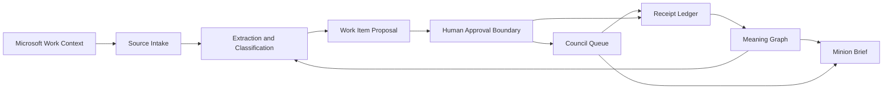
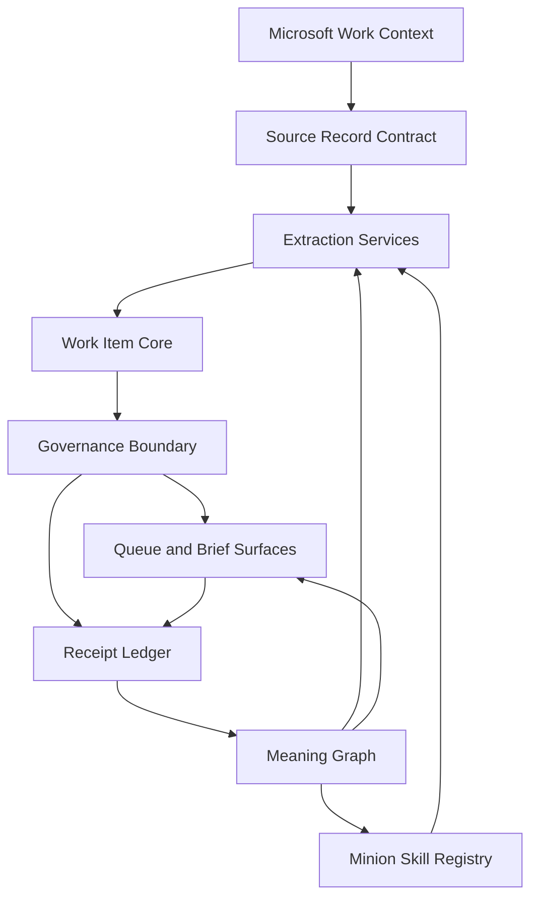
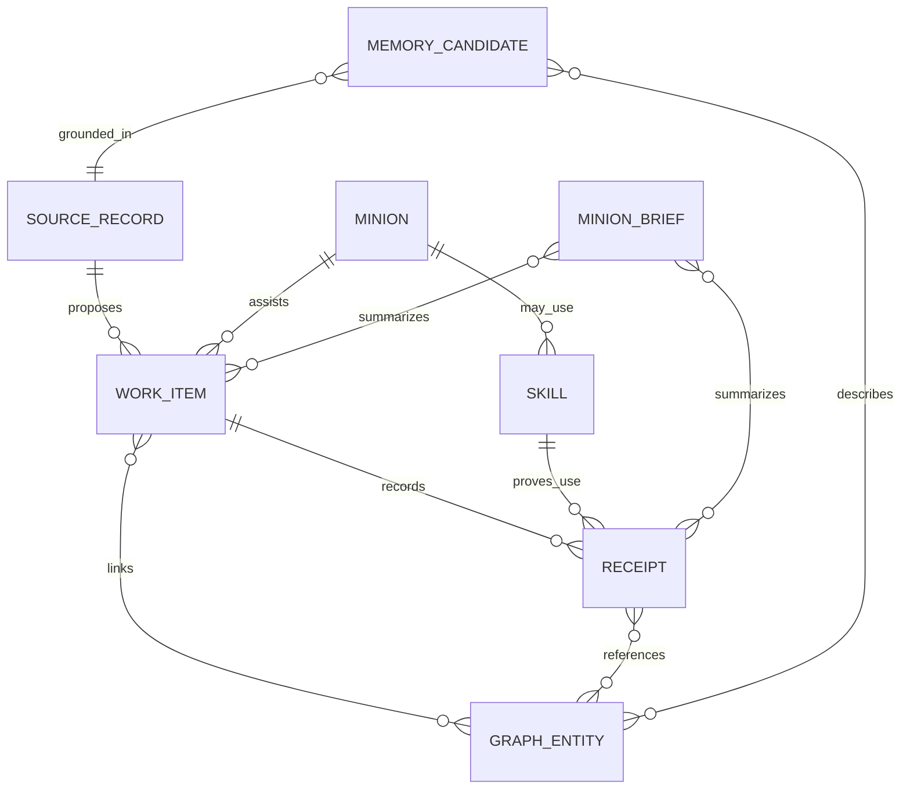

# Architecture Spine - The Council of Minions

## Design Paradigm

The Council uses a **source-to-work-item control plane** paradigm.

Source records from Microsoft work context are normalized into proposed work items. Human-approved work items move through visible states. Every meaningful mutation leaves a receipt. The Meaning Graph supplies context, provenance, routing signals, and explanation, but it does not execute workflow.



Dependency direction:



## Invariants & Rules

### AD-1 - Microsoft-first product boundary [ADOPTED]

- **Binds:** all
- **Prevents:** copying Open Brain, Open Engine, Linear, Slack, Supabase, or other source-project implementation stacks into the Council product model.
- **Rule:** Architecture must express product concepts in Microsoft work language first: Outlook messages, Teams conversations, meetings, files, tasks, people, approvals, decisions, commitments, risks, and briefs. Source projects contribute concepts only.

### AD-2 - Source records precede work items [ADOPTED]

- **Binds:** PRD 5.1, PRD 5.2, PRD 5.4, PRD 5.6
- **Prevents:** treating every email, chat, note, meeting, or file as a work item by default.
- **Rule:** All intake enters as a Source Record. A Work Item can be created only by explicit extraction from a Source Record or by explicit human input, and it must preserve provenance plus rationale.

### AD-3 - Work Item is the canonical execution shell [ADOPTED]

- **Binds:** PRD 5.2, PRD 5.3, PRD 5.6, PRD 5.7
- **Prevents:** separate execution systems for email tasks, meeting actions, decisions, risks, delegations, and artifact work.
- **Rule:** A Work Item is the single execution object. Variation belongs in `type`, linked context, required approvals, and required receipts. Phase 1 types are `decision`, `delegation`, `follow_up`, `request`, `risk`, `artifact_task`, and `meeting_action`.

### AD-4 - Human approval boundary [ADOPTED]

- **Binds:** PRD 5.2, PRD 5.3, PRD 5.5, PRD 5.6
- **Prevents:** agents taking outward, sensitive, or authority-expanding actions because a workflow path exists.
- **Rule:** `decision`, `delegation`, `risk`, outbound action, sensitive handling, memory promotion, skill authority expansion, and tenant-affecting activity require human approval before execution. Low-risk `follow_up` and `meeting_action` items may be proposed or auto-created only under explicit confidence and policy bounds.

### AD-5 - Receipt-first mutation [ADOPTED]

- **Binds:** PRD 5.2, PRD 5.4, PRD 5.6, PRD 5.7
- **Prevents:** silent status changes, memory writes, graph updates, or delegation actions that cannot be audited.
- **Rule:** Any state transition, approval, block, hold, resume, review, completion, failure, memory proposal, memory promotion, or external action must append a Receipt. Work Item state, graph links, and brief content are projections from canonical records plus receipts.

### AD-6 - Meaning Graph is not the workflow engine [ADOPTED]

- **Binds:** PRD 5.1, PRD 5.3, PRD 5.4, PRD 5.7
- **Prevents:** encoding business workflow in graph edges until the ontology becomes brittle and opaque.
- **Rule:** The Meaning Graph may drive retrieval, routing signals, provenance, explanation, and audit. It must not own state transitions, approvals, queue movement, or execution policy in MVP.

### AD-7 - Memory candidates before durable instruction [ADOPTED]

- **Binds:** PRD 5.4, PRD 5.5, PRD 5.6, PRD 5.7
- **Prevents:** agent-written observations becoming durable instruction without review.
- **Rule:** Agent-generated durable context enters as a Memory Candidate with source, rationale, confidence, scope, and review state. It becomes binding instruction only after human approval or a trusted-source rule.

### AD-8 - Authority-scoped Minion Skill Registry [ADOPTED]

- **Binds:** PRD 5.3, PRD 5.5, PRD 5.6
- **Prevents:** prompt sprawl, inconsistent Minion behavior, and silent expansion of agent authority.
- **Rule:** A Skill must declare trigger, allowed context, required inputs, authority class, approval requirements, proof owed, and update policy. Skill installation or expansion that adds data access, external action, tool use, or authority requires approval.

### AD-9 - Storage-neutral contract before backend selection [ADOPTED]

- **Binds:** all
- **Prevents:** Dataverse, Planner / To Do, SharePoint, Cosmos DB, Fabric, or any other store becoming an accidental product dependency before requirements are stable.
- **Rule:** Architecture must define object contracts, identity, provenance, mutation rules, and ownership before selecting storage. Backend-specific identifiers, query patterns, and service constraints stay out of the product model until architecture selects them.

### AD-10 - Tenant interaction remains VERIFY IN TENANT [ADOPTED]

- **Binds:** all
- **Prevents:** planning artifacts implying live Microsoft 365 writes, app registrations, broad Graph permissions, agent publishing, or automations are already approved.
- **Rule:** Any live Microsoft tenant behavior, permission, automation, published agent, connector, or data write is marked `VERIFY IN TENANT` until a later phase explicitly authorizes tenant validation or implementation.

### AD-11 - Microsoft intelligence planes before custom substrate [ADOPTED]

- **Binds:** all
- **Prevents:** rebuilding custom semantic search, business-skill, memory, MCP-tool, human-review, ontology, or graph services before evaluating the Microsoft-native planes now designed for those roles.
- **Rule:** Before selecting a custom implementation for work context, business data grounding, agent tools, human-in-loop review, ontology, graph, memory, or analytics, architecture must evaluate the relevant Microsoft plane first: Work IQ, Dataverse intelligence / Dataverse MCP, Power Apps MCP agent feed, Copilot Studio, Power Automate, Fabric IQ / Fabric Graph, and Fabric data agents. Custom services are allowed only for gaps recorded against Council contracts, tenant constraints, lifecycle maturity, licensing, cost, or governance.

## Consistency Conventions

| Concern | Convention |
| --- | --- |
| Domain nouns | Use `Source Record`, `Work Item`, `Work Item Type`, `Meaning Graph`, `Receipt`, `Memory Candidate`, `Skill`, `Minion`, and `Minion Brief` exactly. |
| Work-item identity | Use stable Council-level Work Item IDs in requirements and examples. Do not expose backend-specific IDs as product identifiers. |
| Source identity | Every Source Record must keep source system, source object reference, capture timestamp, and source-to-work-item rationale. |
| Time | Use ISO 8601 timestamps in architecture artifacts. User-facing display can localize later. |
| State groups | Use product-level state groups: proposed, approved, blocked, held, in review, completed, failed. Concrete status names are deferred to UX and implementation. |
| Receipts | Receipt verbs should be product-level and audit-friendly: proposed, approved, delegated, blocked, held, resumed, reviewed, completed, failed, memory proposed, memory promoted. |
| Confidence | Extraction, owner suggestion, work-item type, risk, urgency, and memory candidates must preserve confidence plus explanation. |
| Memory | Evidence, candidate memory, and approved instruction are separate states. Do not collapse them into one note or prompt. |
| Graph edges | Prefer a small explicit edge vocabulary. Free-form semantic links are not valid architecture defaults. |
| Microsoft services | Treat Microsoft services as candidate intelligence planes or product surfaces until a later architecture decision binds a verified implementation choice. Record tenant, preview, licensing, governance, and cost checks before adoption. |

## Structural Seed

### Core Object Model



### Minimal Source Tree Seed

```text
_bmad-output/
  planning-artifacts/
    prds/                 # product requirements and source synthesis
    architecture/         # architecture spine and architecture memlog
  implementation-artifacts/ # future story and implementation artifacts
docs/
  ontology/               # future Council ontology notes and diagrams
  microsoft-first/        # future Microsoft work-surface mapping notes
```

## Capability -> Architecture Map

| Capability / Area | Lives in | Governed by |
| --- | --- | --- |
| Source Intake and Extraction | Source Record Contract, Extraction Services | AD-1, AD-2, AD-6, AD-10, AD-11 |
| Work Item Queue | Work Item Core, Queue and Brief Surfaces | AD-3, AD-4, AD-5, AD-9, AD-11 |
| Delegation Decision Support | Work Item Core, Governance Boundary, Skill Registry | AD-3, AD-4, AD-7, AD-8, AD-11 |
| Meaning Graph and Context | Meaning Graph, Memory Candidate flow | AD-2, AD-5, AD-6, AD-7, AD-9, AD-11 |
| Skill Registry | Minion Skill Registry | AD-1, AD-4, AD-8, AD-11 |
| Receipts and Audit | Receipt Ledger | AD-4, AD-5, AD-10, AD-11 |
| Minion Brief | Queue and Brief Surfaces, Meaning Graph projection | AD-1, AD-3, AD-5, AD-6, AD-7, AD-11 |

## Deferred

- **Backend store selection:** Deferred until the storage-neutral contract is reviewed. Dataverse, Planner / To Do patterns, SharePoint / Loop, Cosmos DB, Fabric, and graph sidecars remain candidates only.
- **Concrete Microsoft service topology:** Deferred until `VERIFY IN TENANT` constraints are known, including which Microsoft intelligence plane owns each role.
- **Microsoft platform fit matrix:** Deferred until solution architecture. Evaluate Work IQ, Dataverse intelligence / Dataverse MCP, Power Apps MCP agent feed, Copilot Studio, Power Automate, Fabric IQ / Fabric Graph, and Fabric data agents against Council contracts before selecting custom services.
- **Preview, tenant, licensing, and cost gates:** Deferred until tenant validation. Dataverse intelligence, Dataverse MCP, Power Apps MCP agent feed, Work IQ APIs, Fabric IQ, Fabric Graph, and Fabric data agents must be checked for availability, admin settings, data boundaries, governance controls, capacity, and pricing before adoption.
- **Exact queue surface:** Deferred to UX and architecture follow-up. The first visible queue may be task-like, brief-like, Outlook follow-up-like, Teams approval-like, or a combined Council queue.
- **Graph visibility:** Deferred to UX. MVP may expose graph explanations without a graph editor.
- **Skill packaging:** Deferred. The product requires a Skill Registry concept; the implementation can later decide whether skills live in repo docs, Dataverse business skills, SharePoint / Loop, Copilot Studio knowledge, or another managed store.
- **Ontology depth:** Deferred beyond the small operational vocabulary needed for routing, context, provenance, and audit.
- **Automation runner:** Deferred. No scheduler, Power Automate flow, published agent, or live connector is implied by this spine.
