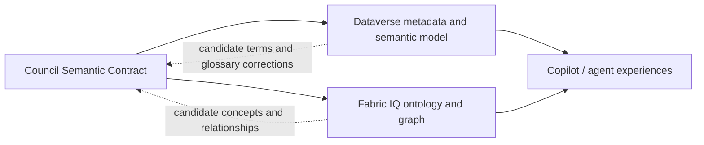

# Semantic Knowledge Placement - 2026-07-07

## Question

How does Dataverse semantic model fit the Council architecture if Fabric IQ ontology and graph can cover similar semantic or knowledge-graph ground?

## Answer

Dataverse semantic model and Fabric IQ are not substitutes at the same architectural layer.

- **Council Semantic Contract** is the canonical product meaning: domain nouns, definitions, identifiers, edge vocabulary, provenance, approval meaning, receipt semantics, and the difference between evidence, memory candidates, and approved instruction.
- **Dataverse semantic model** is the app/business-data interpretation layer for agents and Copilot experiences over Dataverse data. It is generated from Dataverse environment metadata and tuned with signal controls and glossary entries.
- **Fabric IQ ontology / Fabric Graph** is the cross-domain enterprise semantic and relationship layer over Fabric / OneLake data, with explicit entity types, properties, relationships, bindings, lineage, graph traversal, and natural-language ontology querying.

The architecture should keep meaning once, then project it into each Microsoft plane.

## Dataverse Semantic Model Role

Use Dataverse semantic model when Council data lives in Dataverse or is surfaced through model-driven apps, Microsoft 365 Copilot with Dataverse, Dataverse MCP, Copilot Studio agents over Dataverse data, or Dataverse-backed business skills.

It gives those experiences business-aware understanding without forcing agents to infer meaning from raw table and column names. Microsoft documentation says it is automatically provisioned when Copilot experiences over Dataverse data are enabled, uses Dataverse metadata signals, and can be fine-tuned with signal scope and glossary entries.

Architectural fit:

- Map Council nouns to Dataverse table and column display names, descriptions, relationships, public views, and forms.
- Use glossary entries for Council-specific terms like `Work Item`, `Source Record`, `Receipt`, `Memory Candidate`, `Minion`, and `Meaning Graph`.
- Treat semantic-model signal choices as runtime configuration, not as the canonical ontology.
- Do not rely on it as the durable semantic source while it is preview and lacks ALM support.

## Fabric IQ / Graph Role

Use Fabric IQ ontology and Fabric Graph when Council needs cross-domain reasoning, relationship-heavy analysis, OneLake/Fabric integration, lineage, graph traversal, impact analysis, or analytics/briefing over multiple operational and analytical sources.

Fabric IQ is stronger for the enterprise ontology shape: entity types, properties, relationships, constraints, data bindings, provenance, and graph representation. Fabric Graph is stronger for relationship analysis and traversal.

Architectural fit:

- Project the Council Semantic Contract into Fabric IQ entity types, relationships, properties, and bindings.
- Use Fabric Graph for impact chains, dependency paths, and relationship analytics.
- Keep AD-6 intact: Fabric Graph can analyze and explain relationships, but it does not own Council workflow state or approval movement.
- Treat Fabric ontology updates as candidate contract changes unless approved back into the Council contract.

## Operating Rule

One semantic contract, multiple Microsoft-native projections.

## Practical Guidance

- Keep the first version of the Council Semantic Contract in repo/BMAD artifacts until implementation chooses authoritative storage and ALM.
- If Dataverse is selected for operational records, encode definitions in table/column descriptions, relationships, views, forms, and glossary entries so Dataverse semantic model improves agent behavior.
- If Fabric is used, generate or bind Fabric IQ ontology from the approved semantic contract and selected data sources rather than inventing new names in Fabric.
- Create a semantic change process: proposed term or relationship, source, affected platform projections, approval, receipt, and regeneration/deployment action.
- For MVP, define only the terms and relationships that drive routing, context, provenance, audit, approvals, and briefs.

## Watch Items

- Dataverse semantic model is preview documentation and subject to change.
- Dataverse semantic model currently has no new model creation path and no ALM support, so it should not be the only durable semantic source.
- Dataverse semantic model changes apply to a specific semantic model; multiple apps or agents might not share the same semantic model.
- Fabric IQ ontology and Fabric Graph are also preview/tenant-gated and need tenant, capacity, refresh, and governance checks.
- The architecture must prevent dual authoring: terms should not be edited independently in Dataverse glossary and Fabric ontology without a Council contract review.

## Sources

- [Overview of Dataverse semantic model](https://learn.microsoft.com/en-us/power-apps/maker/data-platform/semantic-model-overview)
- [Fine-tune semantic model signals](https://learn.microsoft.com/en-us/power-apps/maker/data-platform/fine-tune-semantic-model-signals)
- [Manage semantic model glossary entries](https://learn.microsoft.com/en-us/power-apps/maker/data-platform/manage-semantic-model-glossary)
- [Dataverse semantic model FAQ](https://learn.microsoft.com/en-us/power-apps/maker/data-platform/semantic-model-faq)
- [What is Fabric IQ?](https://learn.microsoft.com/en-us/fabric/iq/overview)
- [What is ontology in Fabric IQ?](https://learn.microsoft.com/en-us/fabric/iq/ontology/overview)
- [Graph in Microsoft Fabric overview](https://learn.microsoft.com/en-us/fabric/graph/overview)
