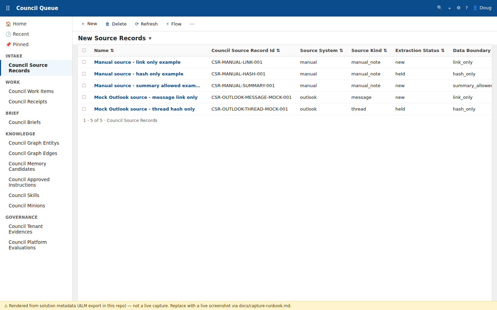
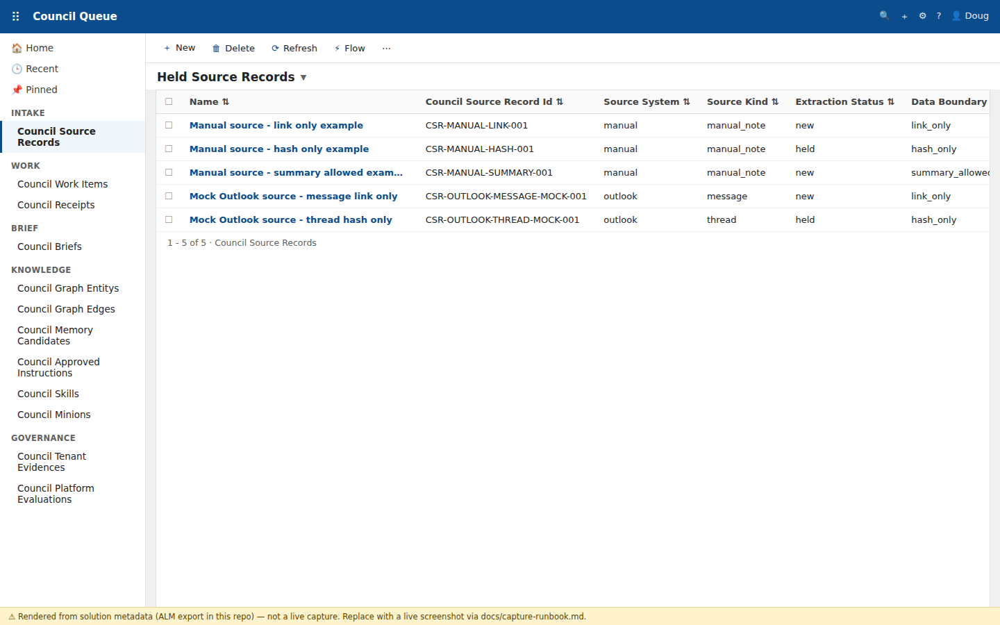
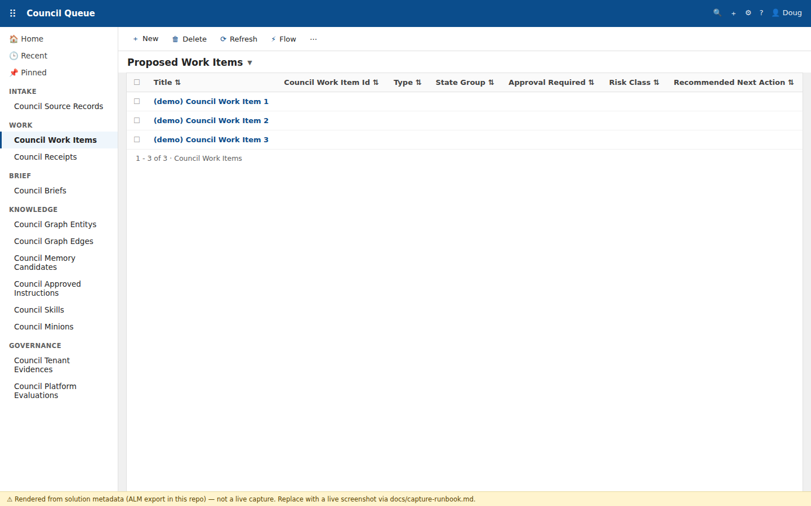
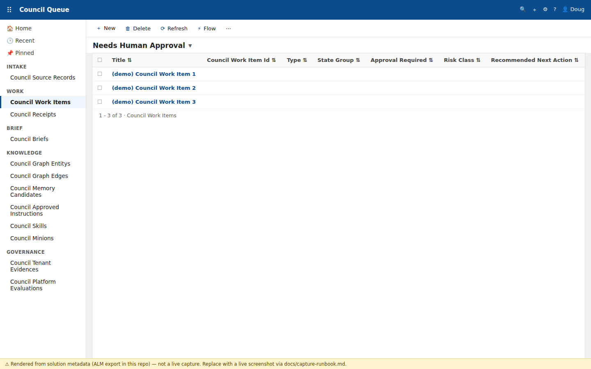
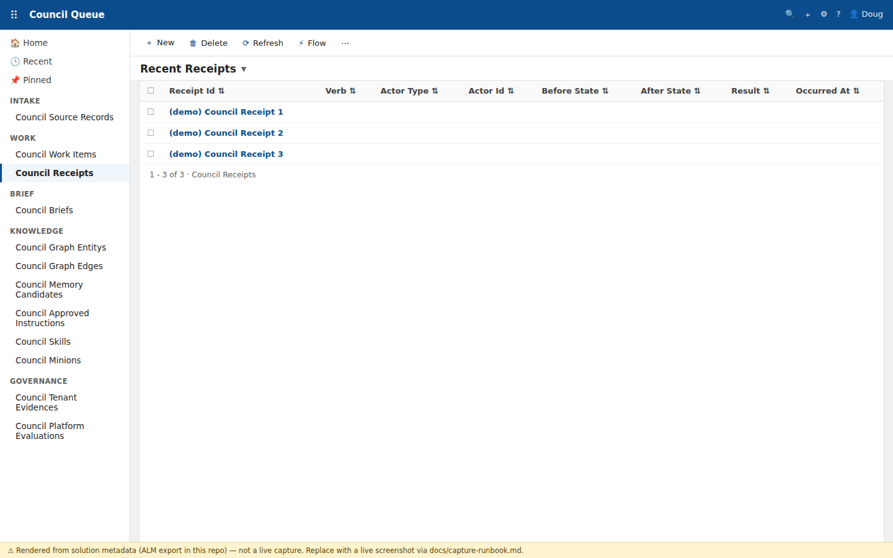
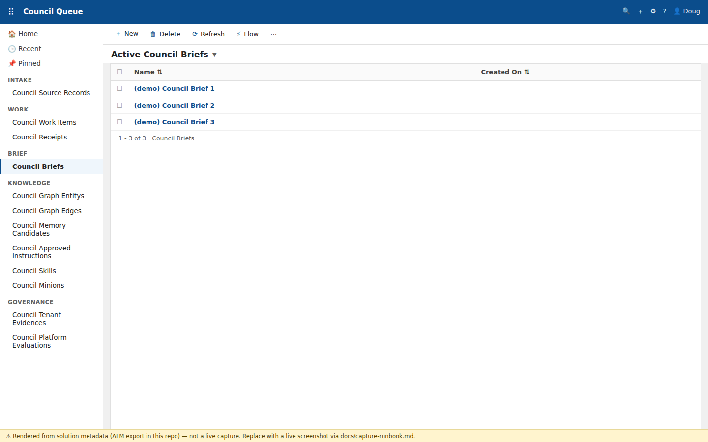

# Using the Council of Minions

*Operator guide for the **Council Queue** app (model-driven, Dataverse). v1 —
2026-07-28. Screenshots are rendered from this repo's own solution metadata and sample
records (each carries a yellow provenance strip); swap in live captures any time via
[capture-runbook.md](capture-runbook.md) — filenames match one-to-one.*

## What this is

The Council turns judgment-heavy email and captured notes into **clean delegation
decisions with receipts**. Sources come in, proposed work items are extracted, **you**
approve or decline, minions execute inside approval boundaries, every state change
writes a receipt, and the Minion Brief shows you the standing picture. You stay the
only human, and nothing outbound happens without you.

## Opening the app

1. Go to your Power Apps environment (make.powerapps.com → your environment) → **Apps**
   → **Council Queue** (`com_CouncilQueue`), or use the direct app URL you bookmarked.
2. Sign in as yourself. The left rail shows five work areas: **Intake · Work · Brief ·
   Knowledge · Governance**.

## The daily loop (two minutes, three stops)

### Stop 1 — Intake: what came in

**Council Source Records → view "New Source Records".** Each row is a captured source
(manual note or Outlook message/thread) awaiting extraction. The columns tell you the
state before you open anything: **Source System** (`manual` / `outlook`), **Source
Kind**, **Extraction Status** (`new` → waiting, `held` → parked by policy), and **Data
Boundary** (`link_only` / `hash_only` / `summary_allowed` — how much content the
Council is allowed to retain from that source).

Check **"Held Source Records"** when something seems missing — holds are deliberate
(drift, supersession, or boundary policy), never silent drops.

### Stop 2 — Work: decide

**Council Work Items → view "Proposed Work Items"** is the extraction output: one row
per proposed piece of work, with rationale carried from its source record.

**The view that actually needs you is "Needs Human Approval".** Open a row, read the
proposal + rationale, then approve or decline on the form. Both paths write a receipt;
approving releases it to the execution shell, declining records why.

> **About the forms (as of the solution export in this repo):** the pinned
> "Information" forms are the minimal scaffold — Title/Name, Owner, and Notes
> (verified: the pinned form IDs in `app-curation-evidence.json` are exactly the
> single exported main forms). The decision context therefore lives in the **view
> columns** and the record's notes, not in a rich form layout. Story 1-1's slice spec
> (`manual-source-record-slice.json` → `visibleFormFields`, 16 fields) defines the
> intended richer form; if your live forms already show those fields, the ALM export
> here is stale — re-export the solution so the repo catches up. Other views map
the rest of the lifecycle: **Approved Work Items → In Review → Completed Recently**,
with **Blocked or Held** and **Failed Needs Review** as the exception lanes.

**Council Receipts → "Recent Receipts"** is the audit trail of everything above —
every state change, idempotent by design. **"Policy Denials"** shows what the rules
refused (worth a weekly skim); **"External Action Requests"** lists outbound actions
waiting on your explicit go — nothing leaves without appearing here first.

### Stop 3 — Brief: the standing picture

**Council Briefs → "Active Council Briefs"** holds the current Minion Brief snapshot —
delegation state, owners, urgency — the thing to read before a day of meetings.

## The other rails (when you need them)

- **Knowledge** — the meaning graph (Graph Entities/Edges), **Memory Candidates**
  (proposals for standing memory — promote only via **Approved Instructions**, which
  requires your approval and writes a receipt), **Skills** and **Minions** (the
  registry of who may do what; authority expansion is approval-gated).
- **Governance** — **Tenant Evidence** (every `VERIFY IN TENANT` proof lives here) and
  **Platform Evaluations** (service-selection records; the Microsoft-first rule made
  auditable).

## Demo data and local validation (from the repo, no tenant writes)

- Deterministic demo seed: `_bmad-output/implementation-artifacts/dataverse-apply-state-transition-demo.ps1`
  (approved write path; see the script header before running).
- Read-only preflight: `dataverse-preflight-readonly.ps1` proves you're in the right
  environment (`pac auth who` / `pac env who`) before anything writes.
- Offline checks (no tenant needed): the `*-slice-validate.ps1` scripts validate the
  captured workflow slices in `_bmad-output/implementation-artifacts/*.json` — the same
  sample records shown in the screenshots above.
- Repo gate: `pwsh .bmad-loop/verify.sh` must stay green.

## Troubleshooting

- **A source record sits in `held`** — that's policy, not failure: check drift/
  supersession fields on the form, and the boundary policy of its source.
- **A work item vanished from "Proposed"** — it moved lanes; check "Needs Human
  Approval" first, then "Blocked or Held".
- **Something failed** — "Failed Needs Review" (work items) and "Failed Receipts"
  (receipts) are the only two places to look; every failure writes a receipt.
- **A form shows more fields than this guide describes** — good news: the live tenant
  is ahead of the repo's ALM export. Re-export the solution
  (`dataverse-export-solution.ps1`) and re-unpack so the repo regains origin-truth.

## Where this is going (the code-first direction)

The model-driven app above stays as the admin surface. The **native operator
surface** — a phone-first app for exactly the daily loop on this same Dataverse
schema — is planned as epic-6:
`_bmad-output/planning-artifacts/epic-6-proposal-council-native-app-2026-07-28.md`,
with the platform evaluation in
`_bmad-output/implementation-artifacts/5-3-evidence-operator-surface-code-first-2026-07-28.md`.
